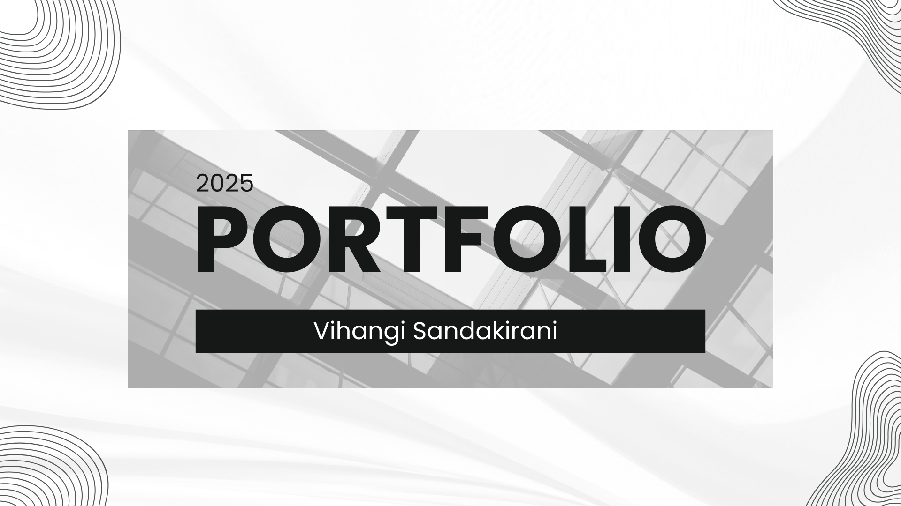

# Portfolio

👩‍💻 Welcome to my personal portfolio repository! This project showcases my skills, projects, and experience as a developer.

## Table of Contents

- [📖 About](#about)
- [💡 Skills](#skills)
- [🛠️ Services](#services)
- [🚀 Projects](#projects)
- [📜 Certificates](#certificates)
- [🗂️ How to Extract the Code](#how-to-extract-the-code)
- [▶️ How to Run](#how-to-run)
- [📫 Contact](#contact)

---

## 📖 About

*(Add details about myself)*

---

## 💡 Skills

*(List my technical skills)*

---

## 🛠️ Services

"(List the services I offer)"

---

## 🚀 Projects

*(Showcase my projects)*

---

## 📜 Certificates

*(List my certificates and achievements)*

---

## 🗂️ How to Extract the Code

To get a copy of this portfolio on your local machine, follow these steps:

1. **Clone the repository:**

   ```bash
   git clone https://github.com/sandakirani/portfolio.git
   ```

2. **Change into the project directory:**

   ```bash
   cd portfolio
   ```

---

## ▶️ How to Run

After extracting the code, you can run this project locally using the following steps:

1. **Install dependencies:**

   ```bash
   npm install
   ```

2. **Start the project:**

   ```bash
   npm start
   ```

   Or, if your project uses a different start script (like `npm run dev`), use that command instead.

---

## 📫 Contact

Feel free to reach out!

- **✉️ Email:** vsandakirani@gmail.com  
- **🔗 LinkedIn:** [Sandakirani](https://linkedin.com/in/vihangi-sandakirani)  
- **🐙 GitHub:** [Sandakirani](https://github.com/sandakirani)

---

*✨ Thank you for visiting my portfolio!*
